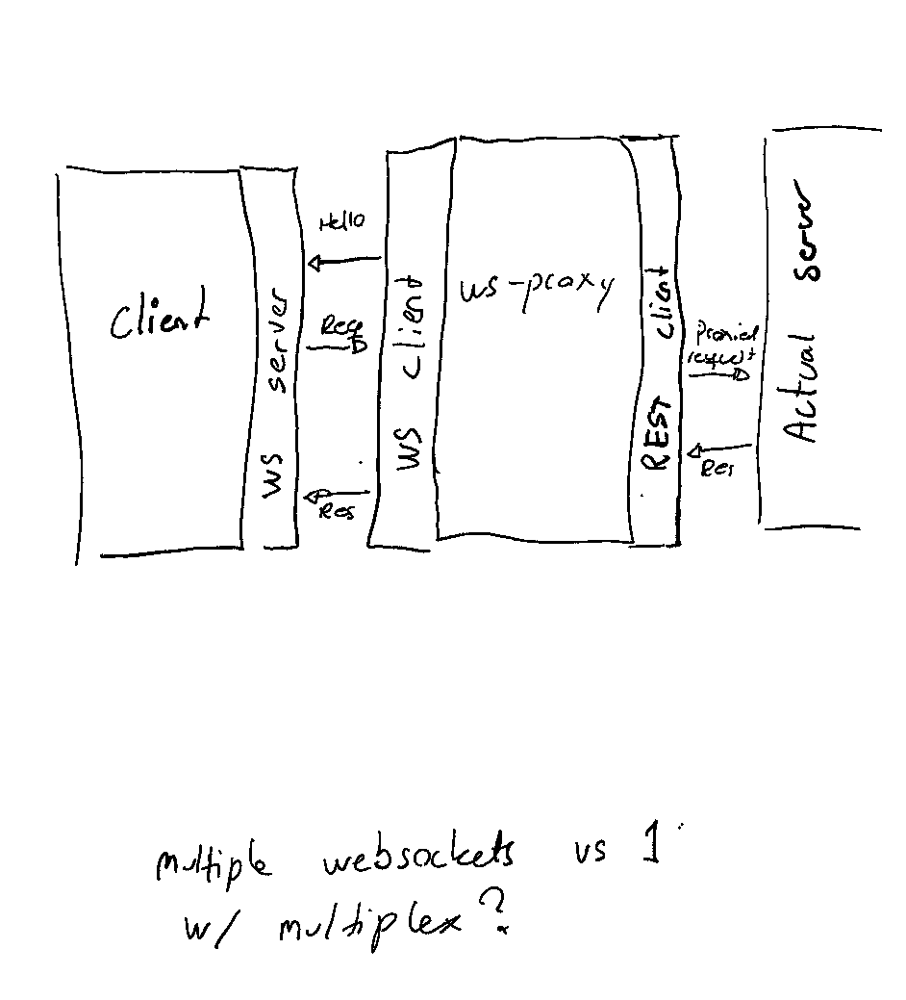

# http-reverse-connect
Tests about server-initiated-http calls

This is basically to allow us to do REST over outbound connections from the server, to satisfy the "only allow outbound connections"
security model.

Currently the demo is between "client" and "aspnetcoreserver", where "client" is the Actual client, but acts as a server in the
websocket setup.

In this demo the "client" starts a websocket server, and listens for incoming requests.
The "server" then starts a client, establishing the outbound connection between them.

The connection is then used for the client to send a message to the server through a simple RPC interface,
that is meant to mimic REST in time.
The "server" then spins up an HttpClient and does a "regular" http call on localhost.

The plan is to mimic calling REST endpoints via websockets, and this is one way to get exactly the same  behaviour.
Another alternative could be to get the required controller via an `IServiceProvider` which is probably less overhead
but might have some subtler issues.

After the REST request is finished, the result is "proxied" back over the websocket request to the client.

This isn't even close to being production-grade code, but it does demonstrate that REST over outbound connections
can be performed.

# Alternative architecture

Instead of needing to add something on the server, it's possible to add a websocket-proxy that establishes the connection, and just
proxies it to REST-requests. The ws-proxy could then have a white-list of allowed endpoints to call.

See diagram below:

An implementation of such a websocket-proxy server is in the branch "feature/rest-over-websockets"

Technically the "WS" server on the client-side could probably also be a standalone-server that proxied REST requests on the websocket connection,
which then only maintained the websocket connections. 

Having them as standalone services means higher overhead, but it also means that clients and servers don't need to care that their communication is going on via WS - to them it's just "regular" http calls.

# Limitations
There's no retry ability currently. To try out the code you have to (in this order)
- start the client (which starts a websocket server)
- start the server (which starts the websocket client and establishes connection)

There's also no multiplexing or support for more than one websocket at a time.

Other approaches:
We could potentially use HTTP2 SSE, like this.
HTTP2 SSE
https://medium.com/blogging-greymatter-io/server-sent-events-http-2-and-envoy-6927c70368bb

License:
No license currently, do not use.